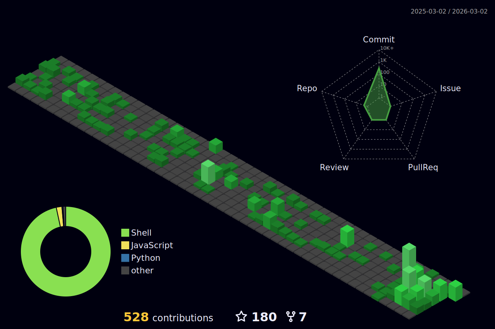

<div align="center" style="max-width: 900px; margin: auto;">
<a href="https://github.com/thunderkex">
  
</a>

## 👋 About Me
- Passionate Full Stack Developer dedicated to building innovative solutions
- Always open to collaborating on exciting projects

## 🛠️ Tech Stack
### Operating Systems
<a href="#"></a>
<a href="#"></a>

### Hardware
<a href="#"></a>
<a href="#"></a>

## 📊 GitHub Stats
<div align="center">
  
  
</div>

## ⚡ Recent Activity
<h4>Watch my contribution graph get eaten by the snake 🐍</h4>


<h4>Isometric view of contributions in the last year.</h4>
<a href="./profile-3d-contrib/profile-night-green.svg">
	
</a>

## 📈 Dev Metrics
<!--START_SECTION:waka-->


**I'm an Early 🐤** 

```text
🌞 Morning                607 commits         ██████████████░░░░░░░░░░░   54.20 % 
🌆 Daytime                442 commits         ██████████░░░░░░░░░░░░░░░   39.46 % 
🌃 Evening                69 commits          ██░░░░░░░░░░░░░░░░░░░░░░░   06.16 % 
🌙 Night                  2 commits           ░░░░░░░░░░░░░░░░░░░░░░░░░   00.18 % 
```
📅 **I'm Most Productive on Monday** 

```text
Monday                   247 commits         ██████░░░░░░░░░░░░░░░░░░░   22.05 % 
Tuesday                  176 commits         ████░░░░░░░░░░░░░░░░░░░░░   15.71 % 
Wednesday                195 commits         ████░░░░░░░░░░░░░░░░░░░░░   17.41 % 
Thursday                 224 commits         █████░░░░░░░░░░░░░░░░░░░░   20.00 % 
Friday                   206 commits         █████░░░░░░░░░░░░░░░░░░░░   18.39 % 
Saturday                 63 commits          █░░░░░░░░░░░░░░░░░░░░░░░░   05.62 % 
Sunday                   9 commits           ░░░░░░░░░░░░░░░░░░░░░░░░░   00.80 % 
```


📊 **This Week I Spent My Time On** 

```text
🕑︎ Time Zone: Asia/Jakarta

💬 Programming Languages: 
PHP                      7 hrs 52 mins       █████████░░░░░░░░░░░░░░░░   35.66 % 
Bash                     2 hrs 41 mins       ███░░░░░░░░░░░░░░░░░░░░░░   12.20 % 
JavaScript               1 hr 51 mins        ██░░░░░░░░░░░░░░░░░░░░░░░   08.45 % 
Blade Template           1 hr 26 mins        ██░░░░░░░░░░░░░░░░░░░░░░░   06.54 % 
Other                    1 hr 23 mins        ██░░░░░░░░░░░░░░░░░░░░░░░   06.32 % 

🐱‍💻 Projects: 
android_device_munch     5 hrs 34 mins       ██████░░░░░░░░░░░░░░░░░░░   25.22 % 
avia-ams-main            4 hrs 49 mins       █████░░░░░░░░░░░░░░░░░░░░   21.88 % 
cms                      4 hrs 13 mins       █████░░░░░░░░░░░░░░░░░░░░   19.16 % 
avianapi                 2 hrs 19 mins       ███░░░░░░░░░░░░░░░░░░░░░░   10.50 % 
revanced-extended        2 hrs 8 mins        ██░░░░░░░░░░░░░░░░░░░░░░░   09.70 % 

💻 Operating System: 
Windows                  21 hrs 28 mins      ████████████████████████░   97.26 % 
Linux                    36 mins             █░░░░░░░░░░░░░░░░░░░░░░░░   02.74 % 
```

**I Mostly Code in Shell** 

```text
Shell                    6 repos             █████░░░░░░░░░░░░░░░░░░░░   19.35 % 
JavaScript               6 repos             █████░░░░░░░░░░░░░░░░░░░░   19.35 % 
C++                      5 repos             ████░░░░░░░░░░░░░░░░░░░░░   16.13 % 
Makefile                 1 repo              █░░░░░░░░░░░░░░░░░░░░░░░░   03.23 % 
Rust                     1 repo              █░░░░░░░░░░░░░░░░░░░░░░░░   03.23 % 
```


 Last Updated on 12/04/2025 00:46:09 UTC
<!--END_SECTION:waka-->
</div>
