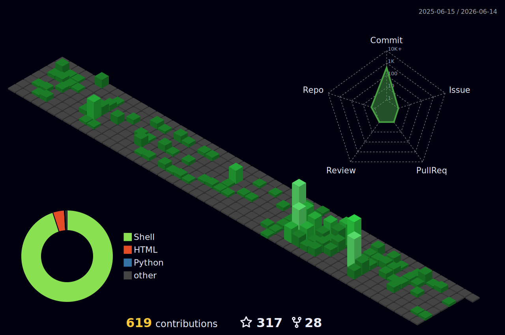

<div align="center">
  <a href="https://github.com/thunderkex">
    
  </a>
</div>

<br/>

## 👋 About Me

Hey there! I'm a **Full Stack Developer** 👨‍💻 with a passion for building intelligent, scalable solutions. I specialize in:

- 🌐 **Cloud Architecture** - Designing robust backend systems and APIs
- 💻 **Cross-Platform Development** - From web applications to IoT devices  
- 📊 **Data-Driven Solutions** - Transforming data into actionable insights
- 🤖 **AI & Machine Learning** - Building intelligent systems
- 🔧 **Automation** - Making things work smarter, not harder

### 🤝 Let's Connect:

💡 I'm always eager to collaborate on innovative projects, especially those involving **automation** and **smart systems**. Let's build something amazing together! 🚀

<br clear="both"/>

---

## 🛠️ Tech Stack

### 💻 Languages
<p align="center">
  
</p>

### 🚀 Frameworks & Libraries
<p align="center">
  
</p>

### 🗄️ Databases
<p align="center">
  
</p>

### 🛠️ Tools & DevOps
<p align="center">
  
</p>

### 💻 Operating Systems
<p align="center">
  
</p>

### ⚡ Hardware & IoT
<p align="center">
  
</p>

## 📊 GitHub Stats

<div align="center">
  
</div>

<div align="center">
  
</div>

## 📈 Dev Metrics
<!--START_SECTION:waka-->


**I'm an Early 🐤** 

```text
🌞 Morning                787 commits         █████████████░░░░░░░░░░░░   50.29 % 
🌆 Daytime                557 commits         █████████░░░░░░░░░░░░░░░░   35.59 % 
🌃 Evening                207 commits         ███░░░░░░░░░░░░░░░░░░░░░░   13.23 % 
🌙 Night                  14 commits          ░░░░░░░░░░░░░░░░░░░░░░░░░   00.89 % 
```
📅 **I'm Most Productive on Monday** 

```text
Monday                   319 commits         █████░░░░░░░░░░░░░░░░░░░░   20.38 % 
Tuesday                  280 commits         ████░░░░░░░░░░░░░░░░░░░░░   17.89 % 
Wednesday                256 commits         ████░░░░░░░░░░░░░░░░░░░░░   16.36 % 
Thursday                 281 commits         ████░░░░░░░░░░░░░░░░░░░░░   17.96 % 
Friday                   303 commits         █████░░░░░░░░░░░░░░░░░░░░   19.36 % 
Saturday                 89 commits          █░░░░░░░░░░░░░░░░░░░░░░░░   05.69 % 
Sunday                   37 commits          █░░░░░░░░░░░░░░░░░░░░░░░░   02.36 % 
```


📊 **This Week I Spent My Time On** 

```text
🕑︎ Time Zone: Asia/Jakarta

💬 Programming Languages: 
Bash                     3 hrs 44 mins       ████████████░░░░░░░░░░░░░   46.23 % 
PHP                      1 hr 41 mins        █████░░░░░░░░░░░░░░░░░░░░   20.93 % 
TOML                     1 hr 18 mins        ████░░░░░░░░░░░░░░░░░░░░░   16.21 % 
Markdown                 32 mins             ██░░░░░░░░░░░░░░░░░░░░░░░   06.75 % 
JavaScript               31 mins             ██░░░░░░░░░░░░░░░░░░░░░░░   06.41 % 

🐱‍💻 Projects: 
revanced-extended        5 hrs 48 mins       ██████████████████░░░░░░░   71.80 % 
cms                      1 hr 5 mins         ███░░░░░░░░░░░░░░░░░░░░░░   13.55 % 
orion                    34 mins             ██░░░░░░░░░░░░░░░░░░░░░░░   07.04 % 
mmm-api                  31 mins             ██░░░░░░░░░░░░░░░░░░░░░░░   06.42 % 
android_device_munch     2 mins              ░░░░░░░░░░░░░░░░░░░░░░░░░   00.55 % 

💻 Operating System: 
Windows                  5 hrs 13 mins       ████████████████░░░░░░░░░   64.52 % 
Linux                    2 hrs 52 mins       █████████░░░░░░░░░░░░░░░░   35.48 % 
```

**I Mostly Code in JavaScript** 

```text
JavaScript               9 repos             ███████░░░░░░░░░░░░░░░░░░   28.12 % 
Python                   5 repos             ████░░░░░░░░░░░░░░░░░░░░░   15.62 % 
Kotlin                   3 repos             ██░░░░░░░░░░░░░░░░░░░░░░░   09.38 % 
Starlark                 1 repo              █░░░░░░░░░░░░░░░░░░░░░░░░   03.12 % 
Batchfile                1 repo              █░░░░░░░░░░░░░░░░░░░░░░░░   03.12 % 
```


 Last Updated on 28/02/2026 02:25:08 UTC
<!--END_SECTION:waka-->

---

## ⚡ Visual Activity

<details>
<summary>🎬 Click to see contribution animations ✨</summary>

<div align="center">
<h4>🐍 Watch my contribution graph get eaten by the snake!</h4>


<h4>📊 Isometric view of contributions in the last year 🎨</h4>
<a href="./profile-3d-contrib/profile-night-green.svg">
	
</a>
</div>

</details>

---
