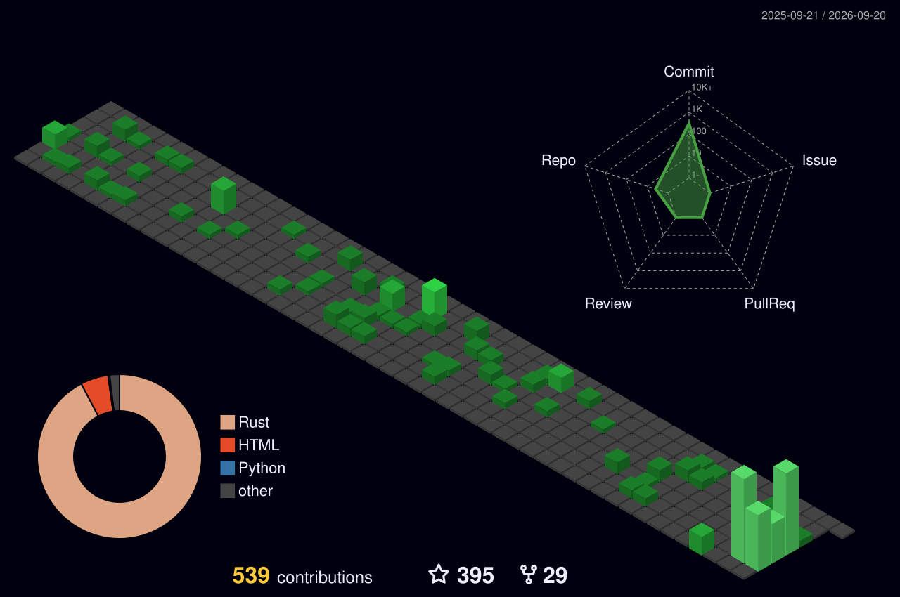

<div align="center">
  <a href="https://github.com/thunderkex">
    
  </a>
</div>

<br/>

## 👋 About Me

Hey there! I'm a **Full Stack Developer** 👨‍💻 with a passion for building intelligent, scalable solutions. I specialize in:

- 🌐 **Cloud Architecture** - Designing robust backend systems and APIs
- 💻 **Cross-Platform Development** - From web applications to IoT devices  
- 📊 **Data-Driven Solutions** - Transforming data into actionable insights
- 🤖 **AI & Machine Learning** - Building intelligent systems
- 🔧 **Automation** - Making things work smarter, not harder

### 🤝 Let's Connect:

💡 I'm always eager to collaborate on innovative projects, especially those involving **automation** and **smart systems**. Let's build something amazing together! 🚀

<br clear="both"/>

---

## 🛠️ Tech Stack

### 💻 Languages
<p align="center">
  
</p>

### 🚀 Frameworks & Libraries
<p align="center">
  
</p>

### 🗄️ Databases
<p align="center">
  
</p>

### 🛠️ Tools & DevOps
<p align="center">
  
</p>

### 💻 Operating Systems
<p align="center">
  
</p>

### ⚡ Hardware & IoT
<p align="center">
  
</p>

## 📊 GitHub Stats

<div align="center">
  
</div>

<div align="center">
  
</div>

## 📈 Dev Metrics
<!--START_SECTION:waka-->


**I'm an Early 🐤** 

```text
🌞 Morning                1999 commits        ██████████████░░░░░░░░░░░   55.65 % 
🌆 Daytime                1313 commits        █████████░░░░░░░░░░░░░░░░   36.55 % 
🌃 Evening                211 commits         █░░░░░░░░░░░░░░░░░░░░░░░░   05.87 % 
🌙 Night                  69 commits          ░░░░░░░░░░░░░░░░░░░░░░░░░   01.92 % 
```
📅 **I'm Most Productive on Monday** 

```text
Monday                   769 commits         █████░░░░░░░░░░░░░░░░░░░░   21.41 % 
Tuesday                  750 commits         █████░░░░░░░░░░░░░░░░░░░░   20.88 % 
Wednesday                513 commits         ████░░░░░░░░░░░░░░░░░░░░░   14.28 % 
Thursday                 686 commits         █████░░░░░░░░░░░░░░░░░░░░   19.10 % 
Friday                   656 commits         █████░░░░░░░░░░░░░░░░░░░░   18.26 % 
Saturday                 137 commits         █░░░░░░░░░░░░░░░░░░░░░░░░   03.81 % 
Sunday                   81 commits          █░░░░░░░░░░░░░░░░░░░░░░░░   02.26 % 
```


📊 **This Week I Spent My Time On** 

```text
🕑︎ Time Zone: Asia/Jakarta

💬 Programming Languages: 
PHP                      22 hrs 3 mins       █████████████████░░░░░░░░   66.16 % 
Markdown                 4 hrs 1 min         ███░░░░░░░░░░░░░░░░░░░░░░   12.07 % 
CSS                      3 hrs 6 mins        ██░░░░░░░░░░░░░░░░░░░░░░░   09.31 % 
Bash                     1 hr 16 mins        █░░░░░░░░░░░░░░░░░░░░░░░░   03.80 % 
Other                    56 mins             █░░░░░░░░░░░░░░░░░░░░░░░░   02.83 % 

🐱‍💻 Projects: 
moorlife_creator         15 hrs 21 mins      ████████████░░░░░░░░░░░░░   46.10 % 
moorlife_creator_ci4     14 hrs 40 mins      ███████████░░░░░░░░░░░░░░   44.03 % 
cms                      31 mins             ░░░░░░░░░░░░░░░░░░░░░░░░░   01.59 % 
hardware_dolby           31 mins             ░░░░░░░░░░░░░░░░░░░░░░░░░   01.55 % 
wms-apps                 22 mins             ░░░░░░░░░░░░░░░░░░░░░░░░░   01.14 % 

💻 Operating System: 
Windows                  33 hrs 19 mins      █████████████████████████   100.00 % 
```

🤖 **AI Coding This Week** 

```text
⏱ AI Coding Time: 10 hrs 35 mins (31.76%)

✍️ 3,926 lines written by AI, 7,055 lines written by hand (35.75% AI-written)

🔤 276,020 Input Tokens, 1,645 Output Tokens

💵 $0.85 Estimated AI Cost This Week

🧠 26 AI Sessions, 356 AI Prompts

Github-Copilot           2,615 lines         █████████████████░░░░░░░░   66.34 % 
Composer                 896 lines           ██████░░░░░░░░░░░░░░░░░░░   22.73 % 
Sonnet                   386 lines           ██░░░░░░░░░░░░░░░░░░░░░░░   09.79 % 
Gemini                   45 lines            ░░░░░░░░░░░░░░░░░░░░░░░░░   01.14 % 

🔎 AI Coding Insights:
⚖️ Balanced with AI — 35.75% of written lines came from AI
📝 Concise Prompter — average 141 characters per prompt
🔁 Iterative Prompter — average 14 prompts per session
🔍 Hands-On Reviewer — 99.11% of changed lines were hand-edited
```

**I Mostly Code in JavaScript** 

```text
Python                   5 repos             ████░░░░░░░░░░░░░░░░░░░░░   14.71 % 
PHP                      3 repos             ██░░░░░░░░░░░░░░░░░░░░░░░   08.82 % 
Kotlin                   3 repos             ██░░░░░░░░░░░░░░░░░░░░░░░   08.82 % 
Dart                     1 repo              █░░░░░░░░░░░░░░░░░░░░░░░░   02.94 % 
Starlark                 1 repo              █░░░░░░░░░░░░░░░░░░░░░░░░   02.94 % 
```


 Last Updated on 08/08/2026 01:58:56 UTC
<!--END_SECTION:waka-->

---

## ⚡ Visual Activity

<details>
<summary>🎬 Click to see contribution animations ✨</summary>

<div align="center">
<h4>🐍 Watch my contribution graph get eaten by the snake!</h4>


<h4>📊 Isometric view of contributions in the last year 🎨</h4>
<a href="./profile-3d-contrib/profile-night-green.svg">
	
</a>
</div>

</details>

---
