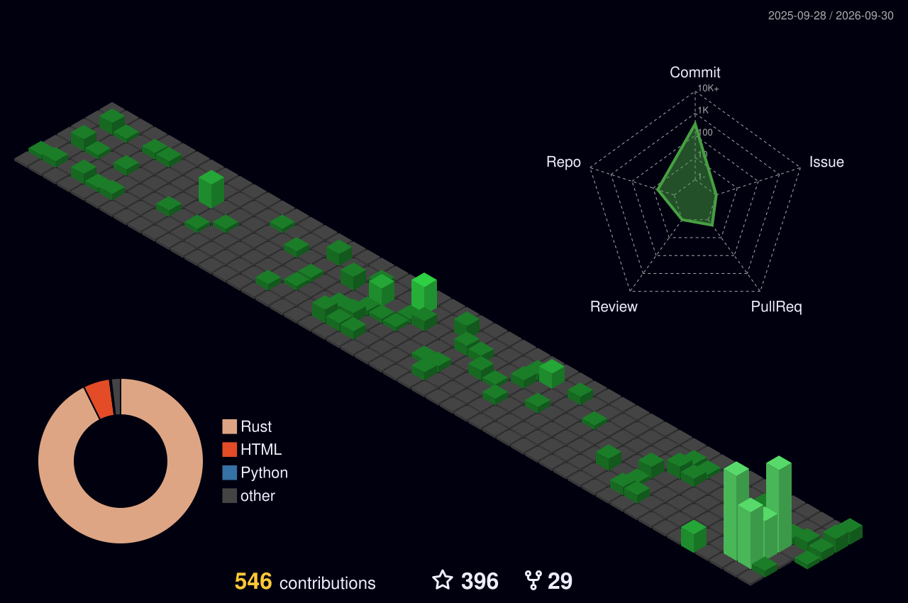

<div align="center">
  <a href="https://github.com/thunderkex">
    
  </a>

  <p align="center" style="max-width:600px;">
    
    I write code for the web, Android, and whatever hardware is nearby — mostly backend and automation, occasionally firmware.
    <br/>
    
    Open to collaboration on things that are actually interesting — IoT, custom Android builds, weird infra problems.
  </p>
</div>

<br/>

<div align="center">

 <b>Stack</b>

<br/><br/>


</div>

<br/>

<div align="center">

 <b>GitHub Stats</b>

<br/><br/>


</div>

<!--START_SECTION:waka-->


**I'm an Early 🐤** 

```text
🌞 Morning                2512 commits        ███████████████░░░░░░░░░░   58.12 % 
🌆 Daytime                1777 commits        ██████████░░░░░░░░░░░░░░░   41.12 % 
🌃 Evening                3 commits           ░░░░░░░░░░░░░░░░░░░░░░░░░   00.07 % 
🌙 Night                  30 commits          ░░░░░░░░░░░░░░░░░░░░░░░░░   00.69 % 
```
📅 **I'm Most Productive on Monday** 

```text
Monday                   1000 commits        ██████░░░░░░░░░░░░░░░░░░░   23.14 % 
Tuesday                  915 commits         █████░░░░░░░░░░░░░░░░░░░░   21.17 % 
Wednesday                600 commits         ███░░░░░░░░░░░░░░░░░░░░░░   13.88 % 
Thursday                 819 commits         █████░░░░░░░░░░░░░░░░░░░░   18.95 % 
Friday                   780 commits         █████░░░░░░░░░░░░░░░░░░░░   18.05 % 
Saturday                 133 commits         █░░░░░░░░░░░░░░░░░░░░░░░░   03.08 % 
Sunday                   75 commits          ░░░░░░░░░░░░░░░░░░░░░░░░░   01.74 % 
```


📊 **This Week I Spent My Time On** 

```text
🕑︎ Time Zone: Asia/Jakarta

💬 Programming Languages: 
PHP                      10 hrs 44 mins      ██████████░░░░░░░░░░░░░░░   41.54 % 
YAML                     2 hrs 57 mins       ███░░░░░░░░░░░░░░░░░░░░░░   11.47 % 
Other                    2 hrs 43 mins       ███░░░░░░░░░░░░░░░░░░░░░░   10.53 % 
Bash                     1 hr 38 mins        ██░░░░░░░░░░░░░░░░░░░░░░░   06.32 % 
Text                     1 hr 31 mins        █░░░░░░░░░░░░░░░░░░░░░░░░   05.93 % 

💻 Operating System: 
Windows                  23 hrs 26 mins      ███████████████████████░░   90.72 % 
Linux                    2 hrs 23 mins       ██░░░░░░░░░░░░░░░░░░░░░░░   09.28 % 
```

**I Mostly Code in JavaScript** 

```text
Rust                     3 repos             ██░░░░░░░░░░░░░░░░░░░░░░░   08.11 % 
PHP                      3 repos             ██░░░░░░░░░░░░░░░░░░░░░░░   08.11 % 
Kotlin                   3 repos             ██░░░░░░░░░░░░░░░░░░░░░░░   08.11 % 
TypeScript               1 repo              █░░░░░░░░░░░░░░░░░░░░░░░░   02.70 % 
Dart                     1 repo              █░░░░░░░░░░░░░░░░░░░░░░░░   02.70 % 
```


 Last Updated on 08/10/2026 05:29:09 UTC
<!--END_SECTION:waka-->

<div align="center">

<details>
<summary>
  
  <b>Contribution activity</b>
</summary>

<br/>


<a href="./profile-3d-contrib/profile-night-green.svg">
  
</a>

</details>

</div>
