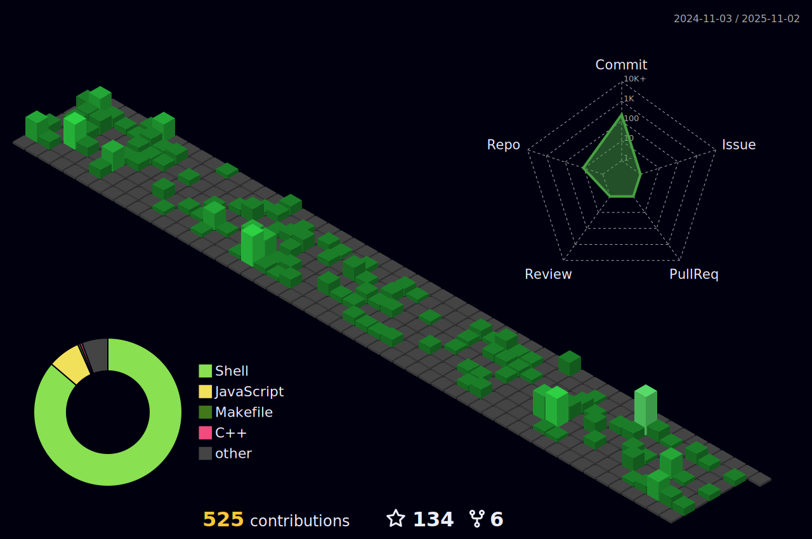

<div align="center" style="max-width: 900px; margin: auto;">
<a href="https://github.com/thunderkex">
  
</a>

## 👋 About Me
- Passionate Full Stack Developer dedicated to building innovative solutions
- Always open to collaborating on exciting projects

## 🛠️ Tech Stack
### Operating Systems
<a href="#"></a>
<a href="#"></a>

### Hardware
<a href="#"></a>
<a href="#"></a>

## 📊 GitHub Stats
<div align="center">
  
  
</div>

## ⚡ Recent Activity
<h4>Watch my contribution graph get eaten by the snake 🐍</h4>


<h4>Isometric view of contributions in the last year.</h4>
<a href="./profile-3d-contrib/profile-night-green.svg">
	
</a>

## 📈 Dev Metrics
<!--START_SECTION:waka-->


**I'm an Early 🐤** 

```text
🌞 Morning                501 commits         █████████████░░░░░░░░░░░░   51.60 % 
🌆 Daytime                406 commits         ██████████░░░░░░░░░░░░░░░   41.81 % 
🌃 Evening                61 commits          ██░░░░░░░░░░░░░░░░░░░░░░░   06.28 % 
🌙 Night                  3 commits           ░░░░░░░░░░░░░░░░░░░░░░░░░   00.31 % 
```
📅 **I'm Most Productive on Monday** 

```text
Monday                   211 commits         █████░░░░░░░░░░░░░░░░░░░░   21.73 % 
Tuesday                  152 commits         ████░░░░░░░░░░░░░░░░░░░░░   15.65 % 
Wednesday                158 commits         ████░░░░░░░░░░░░░░░░░░░░░   16.27 % 
Thursday                 193 commits         █████░░░░░░░░░░░░░░░░░░░░   19.88 % 
Friday                   187 commits         █████░░░░░░░░░░░░░░░░░░░░   19.26 % 
Saturday                 62 commits          ██░░░░░░░░░░░░░░░░░░░░░░░   06.39 % 
Sunday                   8 commits           ░░░░░░░░░░░░░░░░░░░░░░░░░   00.82 % 
```


📊 **This Week I Spent My Time On** 

```text
🕑︎ Time Zone: Asia/Jakarta

💬 Programming Languages: 
PHP                      10 hrs 45 mins      ███████████████░░░░░░░░░░   58.68 % 
Bash                     3 hrs 14 mins       ████░░░░░░░░░░░░░░░░░░░░░   17.66 % 
Other                    1 hr 46 mins        ██░░░░░░░░░░░░░░░░░░░░░░░   09.67 % 
XML                      33 mins             █░░░░░░░░░░░░░░░░░░░░░░░░   03.05 % 
JavaScript               27 mins             █░░░░░░░░░░░░░░░░░░░░░░░░   02.47 % 

🐱‍💻 Projects: 
mms                      8 hrs 15 mins       ███████████░░░░░░░░░░░░░░   45.08 % 
android_device_munch     3 hrs 55 mins       █████░░░░░░░░░░░░░░░░░░░░   21.41 % 
cms                      2 hrs 38 mins       ████░░░░░░░░░░░░░░░░░░░░░   14.39 % 
romcraft                 1 hr 19 mins        ██░░░░░░░░░░░░░░░░░░░░░░░   07.19 % 
gledexkernel             39 mins             █░░░░░░░░░░░░░░░░░░░░░░░░   03.63 % 

💻 Operating System: 
Windows                  16 hrs 58 mins      ███████████████████████░░   92.61 % 
Linux                    1 hr 21 mins        ██░░░░░░░░░░░░░░░░░░░░░░░   07.39 % 
```

**I Mostly Code in Shell** 

```text
Shell                    6 repos             █████░░░░░░░░░░░░░░░░░░░░   19.35 % 
JavaScript               6 repos             █████░░░░░░░░░░░░░░░░░░░░   19.35 % 
C++                      5 repos             ████░░░░░░░░░░░░░░░░░░░░░   16.13 % 
Makefile                 1 repo              █░░░░░░░░░░░░░░░░░░░░░░░░   03.23 % 
Rust                     1 repo              █░░░░░░░░░░░░░░░░░░░░░░░░   03.23 % 
```


 Last Updated on 22/03/2025 00:44:51 UTC
<!--END_SECTION:waka-->
</div>
